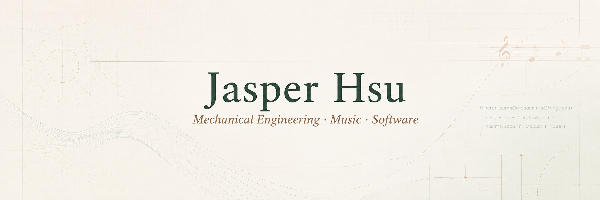
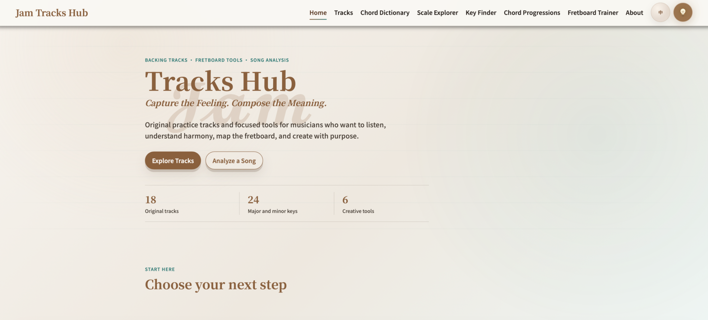
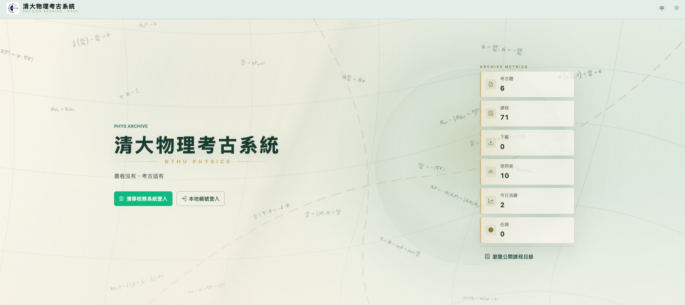

<p align="center">
  
</p>

<p align="center">Mechanical engineering student who plays music, runs a YouTube channel, and develops software.</p>

<p align="center">
  
  
  
  
</p>

---

## 01 / Profile

I am an undergraduate student in the Department of Power Mechanical Engineering at National Tsing Hua University (NTHU), with interests in music and software development. I enjoy building practical software projects, exploring engineering-related topics, and creating music content for YouTube.

```text
Engineering  → understand how things work
Music        → create and express ideas
Software     → turn ideas into useful tools
```

<sub>Mechanical Engineering · Signal Processing · Music · Software Development</sub>

---

## 02 / Selected Work

### Jam Tracks Hub

*MUSIC PLATFORM · GUITAR TOOLS · ACTIVE DEVELOPMENT*



A musician-focused web platform combining original backing tracks with practical tools for guitar practice, music theory, key analysis, and songwriting.

**Focus**

`Backing Track Library` · `Guitar Learning Tools` · `Audio Key Analysis` · `Responsive UI` · `CI/CD & Analytics`

**Stack**

`JavaScript` · `HTML / CSS` · `FastAPI` · `Cloudflare Workers` · `GitHub Actions`

[Live Site ↗](https://jamtrackshub.com) &nbsp;&nbsp; [Repository ↗](https://github.com/Jasper-hsury/Jam_Tracks_Hub)

---

### PhysArchive

*FULL-STACK WEB PLATFORM · OPEN SOURCE · ACTIVE DEVELOPMENT*



An open-source academic resource platform for organizing and sharing past exams, course materials, and student-contributed resources for the NTHU Physics community.

**Focus**

`Information Architecture` · `Course Resource Management` · `Responsive UI` · `User Contributions` · `Testing & Deployment`

**Stack**

`Vue` · `FastAPI` · `PostgreSQL` · `Docker` · `GitHub Actions`

[Live Site ↗](https://physarchive.com) &nbsp;&nbsp; [Repository ↗](https://github.com/NTHU-Physics-SA-IT/PastExamWeb_PHY)

---

## 03 / Current Direction

- Building practical software tools for musicians and music learners.
- Exploring computational methods and their applications in engineering.
- Improving my skills in full-stack development, deployment, and maintainable software architecture.
- Creating and sharing guitar-focused music content on YouTube.

---

## 04 / Contact

<a href="mailto:jasperhsu941029@gmail.com"></a>
<a href="https://www.youtube.com/@Weekly_Backing_Track"></a>
<a href="mailto:Jamtrackshubwork@gmail.com"></a>
